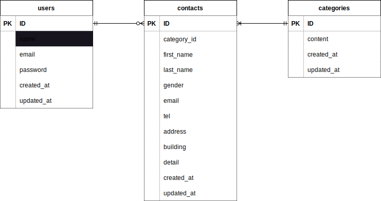

# お問い合わせフォーム

## 環境構築

### Dockerビルド
- 1.git clone git@github.com:ghshzk/confirmation-test.git
- 2.docker-compose up -d --build

### Laravel環境構築
- 1.docker-compose exec php bash
- 2.composer install
- 3.cp .env.example .envをした後に、環境変数を変更
- 4.php artisan key:generate
- 5.php artisan migrate
- 6.php artisan db:seed

## 使用技術(実行環境)
- Laravel 8.83.29
- PHP 7.4.9
- MYSQL 8.0.26
- Nginx 1.21.1

## ER図

## URL
- 開発環境：http://localhost/
- phpMyAdmin：http://localhost:8080/